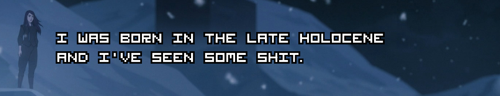
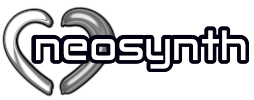
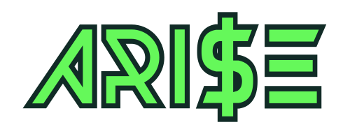
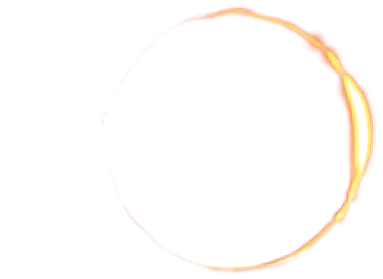
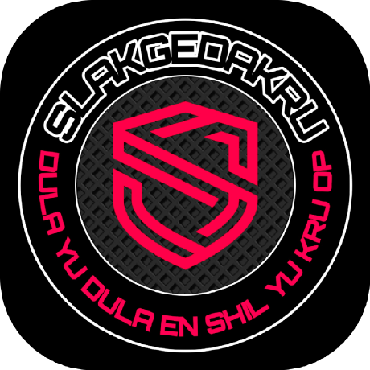
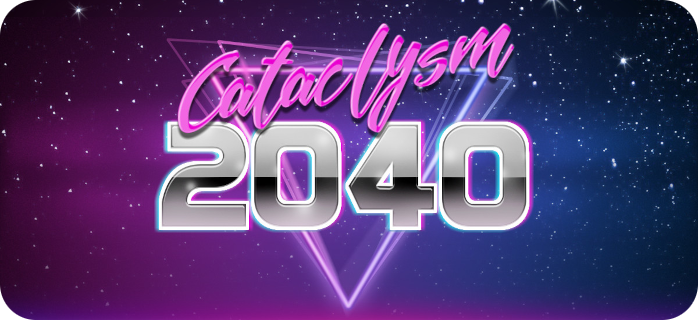

### Places I Post Stuff

<table>
      <tr><td align="center"></td><td>Ecclectic sci-fi fiction writing and opinions</td><td>https://neosynth.net</td></tr>
      <tr><td align="center"></td><td>Security & data archival focused education videos</td><td>https://www.youtube.com/@spectrasecure</td></tr>
</table>

### Stuff I Make

<table>
      <tr><td align="center"></td><td>Low maintenance modular & hierarchical static sites designed to withstand the stresses of time.</td><td>https://ari.se.net</td></tr>
      <tr><td align="center"></td><td>EPCC – Eclipse Phase 1E Character Creator</td><td>https://github.com/neonspectra/epcc</td></tr>
      <tr><td align="center"></td><td>Open source community reference dictionary for the Trigedasleng language</td><td>https://slakgedakru.github.io/</td></tr>
      <tr><td align="center"></td><td>Cyberpunk revival & content restoration fork of Cataclysm: Dark Days Ahead</td><td>https://github.com/neonspectra/Cataclysm-2040</td></tr>
</table>

### Contact
<!-- for future me: handy tool for making shields: https://michaelcurrin.github.io/badge-generator/#/ -->

